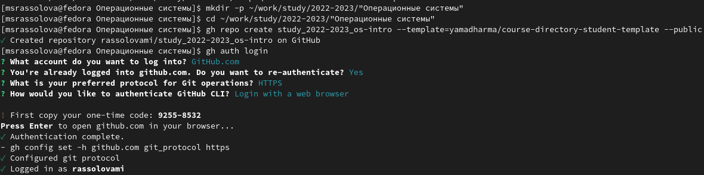

---
## Front matter
title: "Лабораторная работа №2"
subtitle: "Первоначальная настройка git"
author: "Рассолова Маргарита Сергеевна"

## Generic otions
lang: ru-RU
toc-title: "Содержание"

## Bibliography
bibliography: bib/cite.bib
csl: pandoc/csl/gost-r-7-0-5-2008-numeric.csl

## Pdf output format
toc: true # Table of contents
toc-depth: 2
lof: true # List of figures
lot: true # List of tables
fontsize: 12pt
linestretch: 1.5
papersize: a4
documentclass: scrreprt
## I18n polyglossia
polyglossia-lang:
  name: russian
  options:
	- spelling=modern
	- babelshorthands=true
polyglossia-otherlangs:
  name: english
## I18n babel
babel-lang: russian
babel-otherlangs: english
## Fonts
mainfont: PT Serif
romanfont: PT Serif
sansfont: PT Sans
monofont: PT Mono
mainfontoptions: Ligatures=TeX
romanfontoptions: Ligatures=TeX
sansfontoptions: Ligatures=TeX,Scale=MatchLowercase
monofontoptions: Scale=MatchLowercase,Scale=0.9
## Biblatex
biblatex: false
biblio-style: "gost-numeric"
biblatexoptions:
  - parentracker=true
  - backend=biber
  - hyperref=auto
  - language=auto
  - autolang=other*
  - citestyle=gost-numeric
## Pandoc-crossref LaTeX customization
figureTitle: "Рис."
tableTitle: "Таблица"
listingTitle: "Листинг"
lofTitle: "Список иллюстраций"
lotTitle: "Список таблиц"
lolTitle: "Листинги"
## Misc options
indent: true
header-includes:
  - \usepackage{indentfirst}
  - \usepackage{float} # keep figures where there are in the text
  - \floatplacement{figure}{H} # keep figures where there are in the text
---

# Цель работы

Изучить идеологию и применение средств контроля версий.
Освоить умения по работе с git. 

# Теоретическое введение

Система управления версиями — программное обеспечение для облегчения работы с изменяющейся информацией.

Git — это развитая система контроля версий с активной поддержкой и открытым исходным кодом, которую используют тысячи разработчиков из разных точек мира.

# Выполнение лабораторной работы

1. Создала шаблон рабочего пространства (рис. [-@fig:001]).

{#fig:001 width=70%}

2. Создала SSH-ключ. (рис. [-@fig:002]).

{#fig:002 width=70%}

3. Проверила наличие репозитория. (рис. [-@fig:003]).

{#fig:003 width=70%}

4. Клонировала репозиторий. (рис. [-@fig:004]).

{#fig:004 width=70%}

5. Удалила лишние файлы и создала необходимые каталоги. (рис. @fig:005).

{#fig:005 width=70%}

6. Отправила файлы на сервер. (рис. @fig:006)

{#fig:006 width=70%}

7. Продолжение. (рис. @fig:007)

{#fig:007 width=70%}

# Выводы

Изучила идеологию и применение средств контроля версий.
Освоила умения по работе с git.

# Контрольные вопросы

1. Изучить идеологию и применение средств контроля версий.
Освоить умения по работе с git. Система управления версиями (VCS), также известная как система управления исходным кодом, — это программное обеспечение для отслеживания изменений в файловой системе и управления ими.

2. Репозиторий - хранилище версий - в нем хранятся все документы вместе с историей их изменения и другой служебной информацией. 
Команда git commit берёт все данные, добавленные в индекс с помощью git add , и сохраняет их слепок во внутренней базе данных, а затем сдвигает указатель текущей ветки на этот слепок.

# Список литературы{.unnumbered}

::: {#refs}
:::
