---
## Front matter
title: "Лабораторная работа №4"
subtitle: "Основы интерфейса взаимодействия пользователя с системой Unix на уровне командной строки"
author: "Рассолова Маргарита Сергеевна"

## Generic otions
lang: ru-RU
toc-title: "Содержание"

## Bibliography
bibliography: bib/cite.bib
csl: pandoc/csl/gost-r-7-0-5-2008-numeric.csl

## Pdf output format
toc: true # Table of contents
toc-depth: 2
lof: true # List of figures
lot: true # List of tables
fontsize: 12pt
linestretch: 1.5
papersize: a4
documentclass: scrreprt
## I18n polyglossia
polyglossia-lang:
  name: russian
  options:
	- spelling=modern
	- babelshorthands=true
polyglossia-otherlangs:
  name: english
## I18n babel
babel-lang: russian
babel-otherlangs: english
## Fonts
mainfont: PT Serif
romanfont: PT Serif
sansfont: PT Sans
monofont: PT Mono
mainfontoptions: Ligatures=TeX
romanfontoptions: Ligatures=TeX
sansfontoptions: Ligatures=TeX,Scale=MatchLowercase
monofontoptions: Scale=MatchLowercase,Scale=0.9
## Biblatex
biblatex: false
biblio-style: "gost-numeric"
biblatexoptions:
  - parentracker=true
  - backend=biber
  - hyperref=auto
  - language=auto
  - autolang=other*
  - citestyle=gost-numeric
## Pandoc-crossref LaTeX customization
figureTitle: "Рис."
tableTitle: "Таблица"
listingTitle: "Листинг"
lofTitle: "Список иллюстраций"
lotTitle: "Список таблиц"
lolTitle: "Листинги"
## Misc options
indent: true
header-includes:
  - \usepackage{indentfirst}
  - \usepackage{float} # keep figures where there are in the text
  - \floatplacement{figure}{H} # keep figures where there are in the text
---

# Цель работы

Приобретение практических навыков взаимодействия пользователя с системой посредством командной строки.

# Теоретическое введение

Командная строка - это программа, которая эмулирует поле ввода в текстовом экране пользовательского интерфейса. Эту программу можно использовать для выполнения введенных команд и дополнительных функций администрирования.

# Выполнение лабораторной работы

1. Определила полное имя  домашнего каталога (рис. @fig:001).

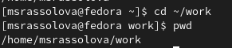{#fig:001 width=70%}

2. Вывела на экран содержимое каталога tmp. Функции ключей: -а (позволяет увидеть скрытые файлы). (рис. @fig:002) 

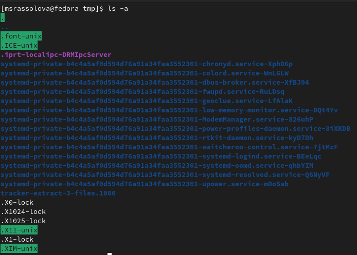{#fig:002 width=70%}

3. Без ключа - видимые файлы.  (рис. @fig:003).

{#fig:003 width=70%}

4. Определила, что в каталоге /var/spool нет подкаталога с именем cron. (рис. @fig:004).

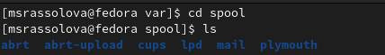{#fig:004 width=70%}

5. Перешла в дом. каталог, вывела его содержимое и определила владельца каталогов и подкаталогов. (рис. @fig:005).

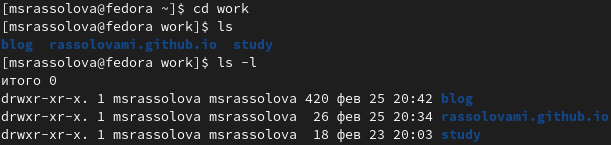{#fig:005 width=70%} 

6. Создала каталог newdir. А в нем - morefun. (рис. @fig:006).

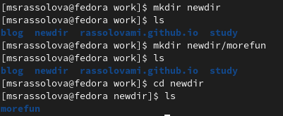{#fig:006 width=70%} 

7. В дом. каталоге создала сразу 3 новых каталога. (рис. @fig:007) 

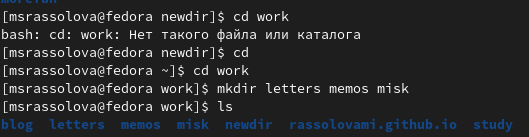{#fig:007 width=70%}

8. Удалила их. (рис. @fig:008)

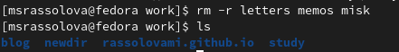{#fig:008 width=70%}

9. Удалила ранее созданный каталог newdir.  (рис. @fig:009)

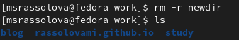{#fig:009 width=70%}

10. Morefun удалился одновременно. (рис. @fig:010)

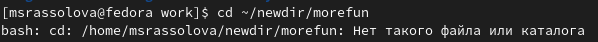{#fig:010 width=70%}

11. Определила команду, которая показывает содержимое каталогов и подкаталогов. (рис. @fig:011).

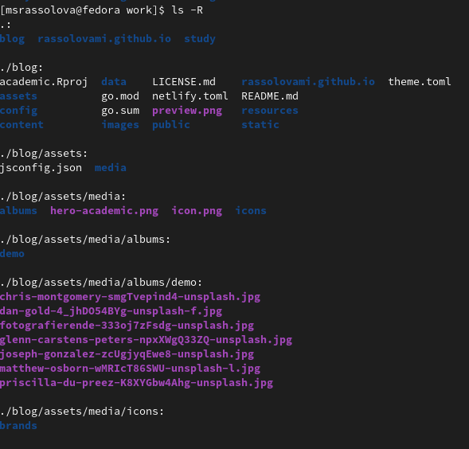{#fig:011 width=70%} 

12. Определила набор опций команды ls. (рис. @fig:012).

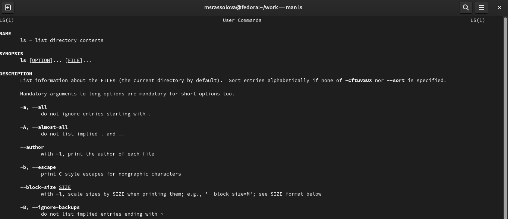{#fig:012 width=70%}

13. Проделала то же самое с остальными командами. (рис. @fig:013).

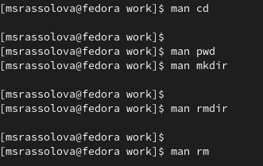{#fig:013 width=70%}

# Выводы

Приобрела практические навыки взаимодействия пользователя с системой посредством командной строки.

# Контрольные вопросы

1. Командная строка - это программа, которая эмулирует поле ввода в текстовом экране пользовательского интерфейса. Эту программу можно использовать для выполнения введенных команд и дополнительных функций администрирования.
2. При помощи команды mkdir. Пример в первом пункте выполнения лабораторной.
3. Команда file.
4. ls -a
5. rm (для файла), rm -r (для каталога). 
6. history
