---
## Front matter
title: "Отчёт по лабораторной работе №5"
subtitle: "дисциплина: Операционные системы"
author: "Рассолова Маргарита Сергеевна"

## Generic otions
lang: ru-RU
toc-title: "Содержание"

## Bibliography
bibliography: bib/cite.bib
csl: pandoc/csl/gost-r-7-0-5-2008-numeric.csl

## Pdf output format
toc: true # Table of contents
toc-depth: 2
lof: true # List of figures
lot: true # List of tables
fontsize: 12pt
linestretch: 1.5
papersize: a4
documentclass: scrreprt
## I18n polyglossia
polyglossia-lang:
  name: russian
  options:
	- spelling=modern
	- babelshorthands=true
polyglossia-otherlangs:
  name: english
## I18n babel
babel-lang: russian
babel-otherlangs: english
## Fonts
mainfont: PT Serif
romanfont: PT Serif
sansfont: PT Sans
monofont: PT Mono
mainfontoptions: Ligatures=TeX
romanfontoptions: Ligatures=TeX
sansfontoptions: Ligatures=TeX,Scale=MatchLowercase
monofontoptions: Scale=MatchLowercase,Scale=0.9
## Biblatex
biblatex: true
biblio-style: "gost-numeric"
biblatexoptions:
  - parentracker=true
  - backend=biber
  - hyperref=auto
  - language=auto
  - autolang=other*
  - citestyle=gost-numeric
## Pandoc-crossref LaTeX customization
figureTitle: "Рис."
tableTitle: "Таблица"
listingTitle: "Листинг"
lofTitle: "Список иллюстраций"
lotTitle: "Список таблиц"
lolTitle: "Листинги"
## Misc options
indent: true
header-includes:
  - \usepackage{indentfirst}
  - \usepackage{float} # keep figures where there are in the text
  - \floatplacement{figure}{H} # keep figures where there are in the text
---

# Цель работы

Целью данной лабораторной работы является ознакомление с файловой системой linux, именами и содержанием каталогов. Приобретение практических
навыков по применению команд для работы с файлами и каталогами, по управлению процессами, по проверке использования диска и обслуживанию файловой
системы.

# Теоретическое введение

Файловая система - Порядок, определяющий способ организации, хранения и именования данных на носителях информации в компьютерах, а также в другом электронном оборудовании: цифровых фотоаппаратах, мобильных телефонах и т. п. Файловая система определяет формат содержимого и способ физического хранения информации, которую принято группировать в виде файлов. Конкретная файловая система определяет размер имен файлов, максимальный возможный размер файла и раздела, набор атрибутов файла. Некоторые файловые системы предоставляют сервисные возможности, например, разграничение доступа или шифрование файлов. 

# Выполнение лабораторной работы

1.  Выполнила примеры, описанные в первой части лабораторной работы. (рис. @fig:001).

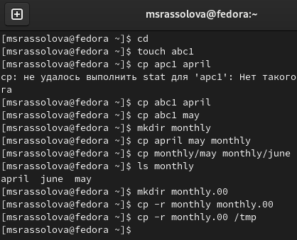{#fig:001 width=70%}

2. Изменила названия файлов. Переместила их в нужные каталоги. (рис. @fig:002).

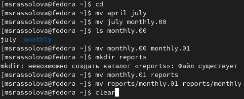{#fig:002 width=70%}

3. Скопировала нужный файл в домашний каталог и переименовала его. (рис. @fig:003).

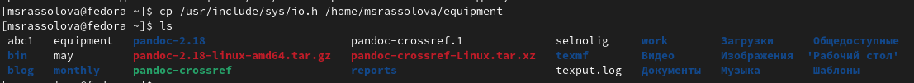{#fig:003 width=70%}

4. Создала директорию в дом.каталоге. Переместила туда файл. (рис. @fig:004).

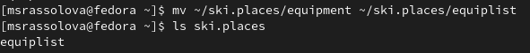{#fig:004 width=70%}

5. Создала файл в дом. каталоге файл и скопировала его в предыдущий, переименовала. (рис. @fig:005).

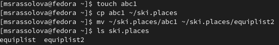{#fig:005 width=70%}

6. Создала новый каталог и перенесла туда файлы. (рис. @fig:006).

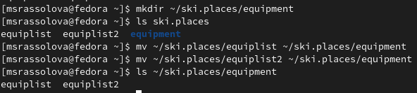{#fig:006 width=70%}

7. Создала новый каталог и перенесла его в ski.places. (рис. @fig:007).

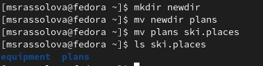{#fig:008 width=70%}

8. Определила опции команды chmod. (рис. @fig:008).

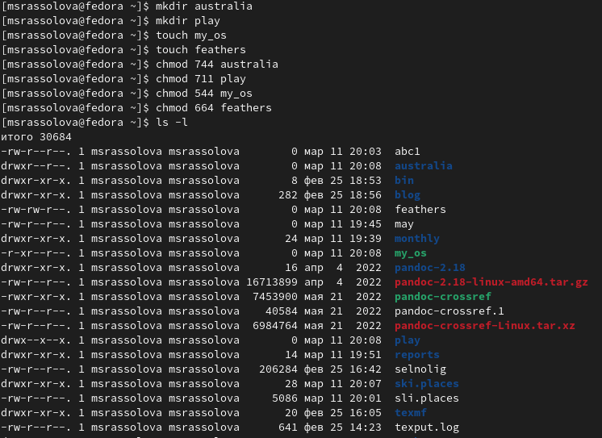{#fig:009 width=70%}

9. Просмотрела содержимое файла /etc/password. (рис. @fig:009).

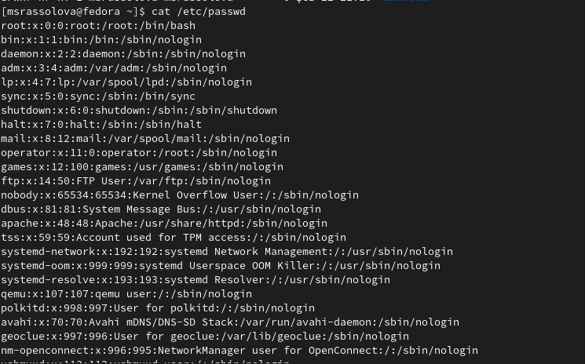{#fig:009 width=70%}

10. Скопировала файл ~/feathers в файл ~/file.old. Переместила файл ~/file.old В каталог ~/play. Скопировала каталог ~/play в каталог ~/fun. Переместила каталог ~/fun в каталог ~/play и назвала его games. Лишила владельца файла feathers прав на чтение. (рис. @fig:010).

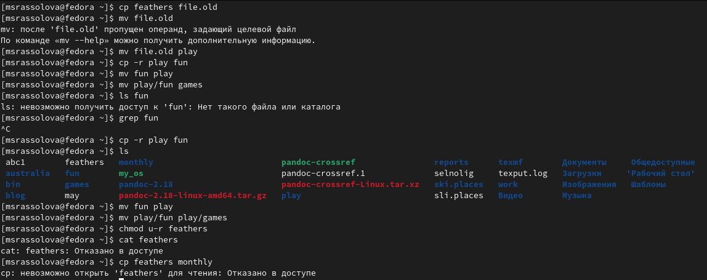{#fig:010 width=70%}

11. Дала владельцу файла feathers право на чтение, лишила владельца каталога play права на выполнение. (рис. @fig:011).

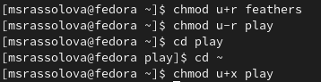{#fig:011 width=70%}

12. Прочитала man по командам mount, fsck, mkfs, kill. (рис. @fig:012).

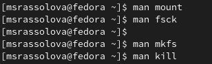{#fig:012 width=70%}

# Выводы

В ходе выполнения данной лабораторной работы я ознакомилась с файловой системой linux, именами и содержанием каталогов, приобрела практические навыки по применению команд для работы с файлами и каталогами, по управлению процессами, по проверке использования диска и обслуживанию файловой системы.

